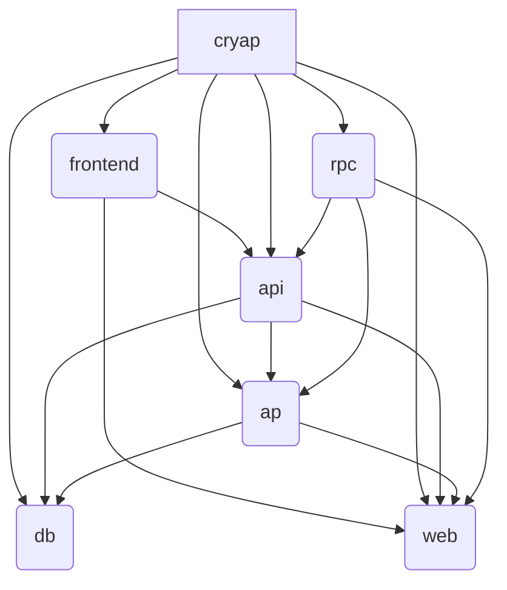

# Architecture
Cryap is divided into several interconnected crates:

- **ap**: ActivityPub related code
- **api**: Mastodon API and OAuth2 implementation
- **db**: Models and all code that directly communicates with the database
- **frontend**: [Leptos](https://leptos.dev) frontend
- **rpc**: RPC admin implementation
- **web**: Common code that is used in all crates

This diagram shows the dependencies between crates:

